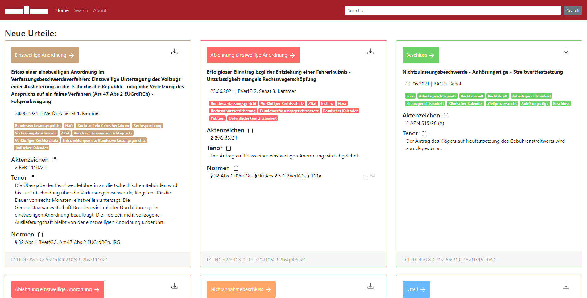

# Projekt Base.Camp21 BLS_Projekt

This project was created in the course of the [Base.Camp-Project](https://www.inf.uni-hamburg.de/inst/basecamp/projects/ba-projekt.html) 2021 Module at University of Hamburg in cooperation with the [Bucerius Law School](https://www.law-school.de/).

The main topic of this project is legal tech. The goal was to create an application that processes and visualizes court judgments by using existig verdicts of the german high courts startig from 2010 onwards.  
The used data can be found on:  
https://www.rechtsprechung-im-internet.de

The demo of the application can be found on:  
http://basecamp-demos.informatik.uni-hamburg.de:8080/BLS_Tool/



## Scraping

## Backend
First make sure that the Elasticsearch Database is setup properly in BLS_Projekt/bls_backend/src/main/java/com/bls_tool/repositories/Config.java, default is localhost:9200.

Build the bls_backend Java project using Maven with the following commands
``` mvn clean
mvn install
mvn package
```
Now there should be a .war file containing the project within the bls_backend target folder. This .war file can be used to deploy on any Tomcat or Apache server.
## Frontend
